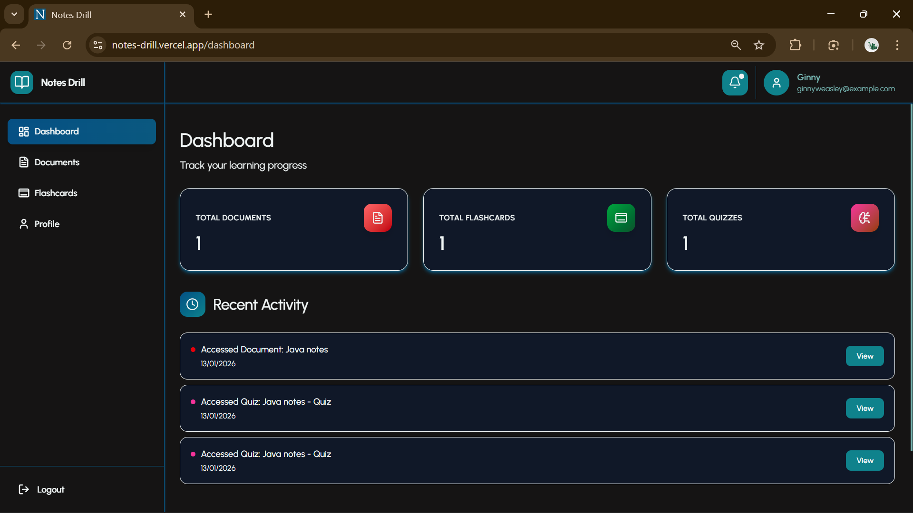
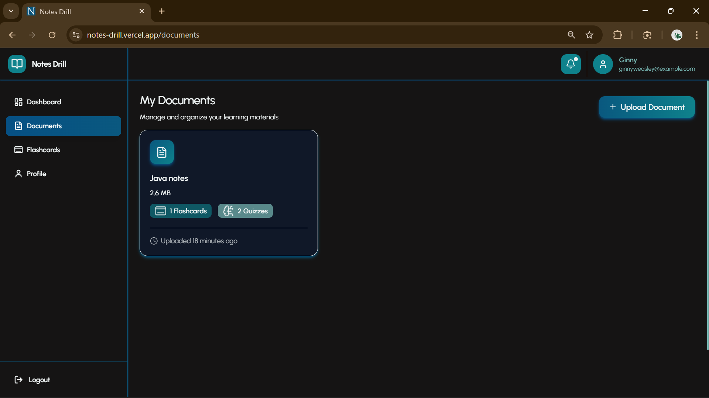
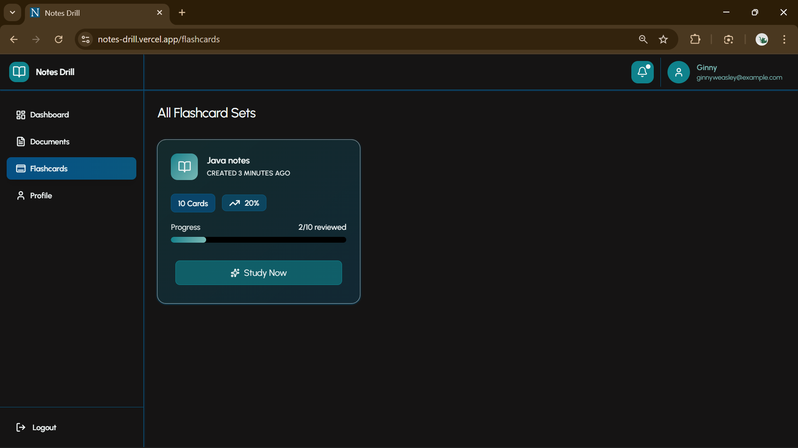
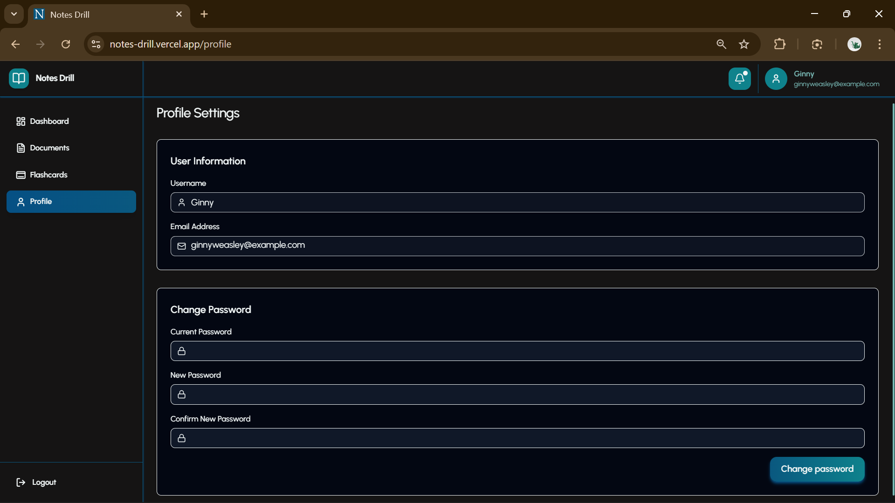
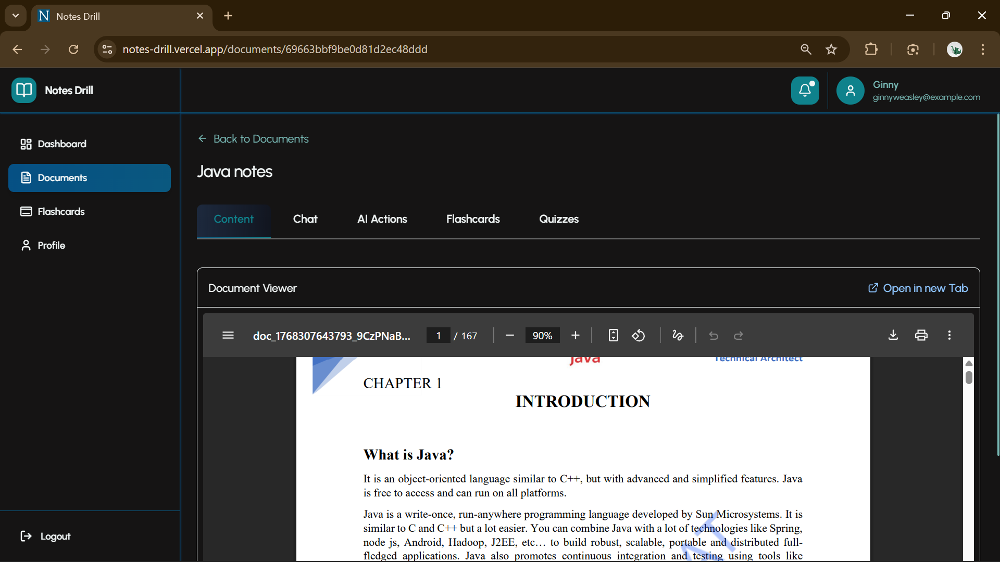
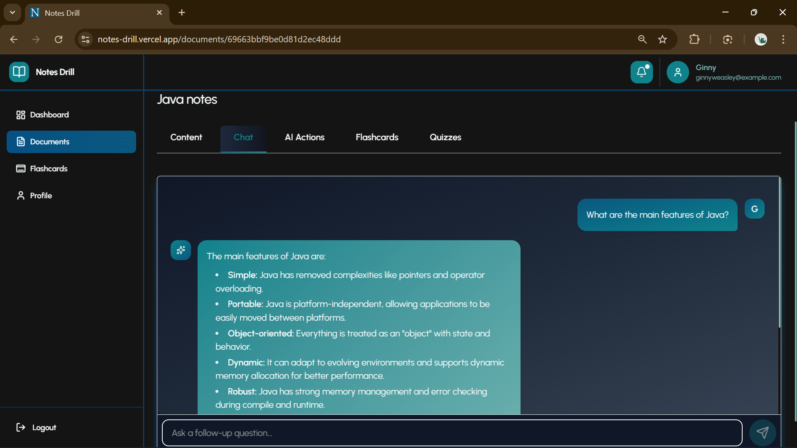
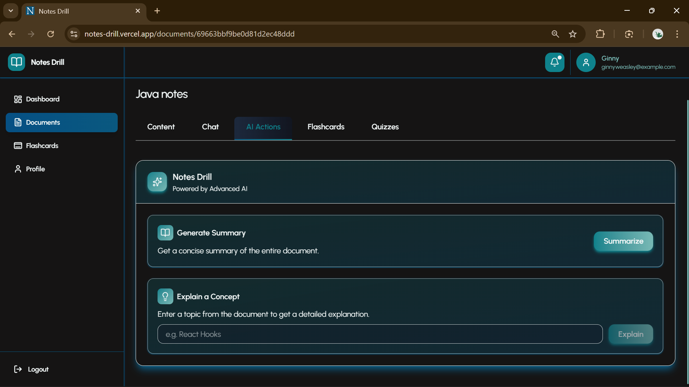
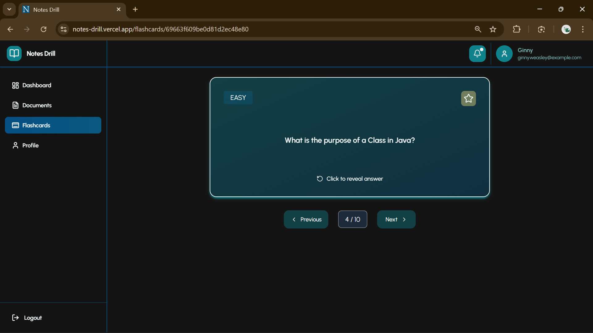
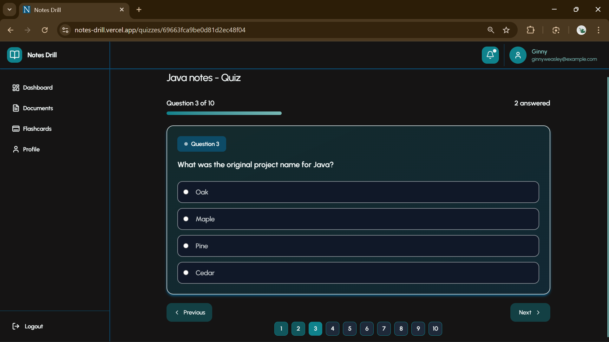

# Smart-Sheet AI

Smart-Sheet AI is an AI-powered learning assistant that turns raw documents into structured learning assets — quizzes, flashcards, summaries, and focused Q&A — instead of passive reading.

Unlike generic AI note tools, all outputs in Smart-Sheet AI are strictly constrained to the uploaded document, ensuring accuracy and explainability.

This project was built to explore production-style AI integration.

**Live link:** https://notes-drill.vercel.app/  
The backend is hosted on Render’s free tier, so the server may take 30–60 seconds to wake up.
If the site doesn’t load immediately, wait a moment and refresh.

---

## Core Features

- **Document Upload (PDF)**  
  Secure upload and processing pipeline

- **AI-Powered Learning Tools**
  - Auto-generated quizzes
  - Flashcards with difficulty levels
  - Concise summaries
  - Concept explanations

- **Document-Aware Chat**
  - Answers questions using only relevant document chunks
  - Prevents generic or out-of-context AI replies

- **Authentication**
  - JWT-based authentication with protected routes

- **User-Specific Data**
  - Documents, quizzes, and flashcards scoped per user

---

## Key Capabilities

- **Cloud-based document upload (ImageKit.io)**
  - Secure PDF uploads with externalized storage
  - Reduces backend load and improves scalability

- **PDF ingestion & processing**
  - Text extraction followed by chunking to preserve semantic context
  - Status-based processing lifecycle (processing / ready / failed)

- **Document-grounded AI generation**
  - Quizzes, flashcards, summaries, and concept explanations generated strictly from relevant document segments
  - Prevents hallucinated or out-of-scope responses

- **Context-aware Q&A**
  - User queries answered using relevance-filtered chunks only
  - Ensures accurate, source-aligned responses

---

## System Design Features

- **Layered architecture with clear separation of concerns**
  - Routes define endpoints and attach middleware
  - Middleware handles authentication, validation, and error handling
  - Controllers contain request handling, business logic, and database interactions
  - Models define MongoDB schemas and data access
  - Frontend services abstract API calls and authentication logic

- **Authentication & data isolation**
  - JWT-based authentication
  - User-scoped documents and learning artifacts

- **Backend-driven, reproducible state**
  - Generated learning artifacts are deterministic, persisted, and reusable
  - Avoids redundant AI calls and simplifies debugging

## Tech Stack

**Frontend**

- React
- Redux Toolkit
- Tailwind CSS

**Backend**

- Node.js
- Express.js
- MongoDB (Mongoose)

**Cloud & AI**

- ImageKit.io (document storage)
- Gemini API (content generation)
- Custom chunking and relevance selection logic

**Engineering Practices**

- RESTful API design
- JWT authentication
- Modular service architecture
- Git-based workflow

---

## Installation & Setup

1. **Clone the repository**

   ```bash
   git clone https://github.com/jain-sarvagya/Smart-Sheet-AI
   cd Smart-Sheet-AI
   ```

2. **Install Dependencies**

   ```bash
   # Frontend
   cd frontend
   npm install

   # Backend
   cd ../backend
   npm install
   ```

3. **Run the application**  
   Open two terminals or use a concurrent command:

   ```bash
   # Frontend
   cd frontend
   npm run dev

   # Backend
   cd backend
   npm run dev
   ```

4. The app will start at your configured ports default on localhost: `frontend:5173, backend:3000`.

---
`
## 🔑 Environment Variables

### Frontend

| Variable           | Description                       |
| ------------------ | --------------------------------- |
| `VITE_BACKEND_URL` | Base URL for backend API requests |

### Backend

| Variable          | Description                                                                                                                                                                            |
| ----------------- | -------------------------------------------------------------------------------------------------------------------------------------------------------------------------------------- |
| `NODE_ENV`        | Defines the application runtime environment (e.g., `development`, `production`) to enable environment-specific behavior such as logging, error handling, and performance optimizations |
| `PORT`            | Port number for the backend server                                                                                                                                                     |
| `MONGO_URI`       | MongoDB connection string                                                                                                                                                              |
| `JWT_SECRET`      | Secret key for generating JSON Web Tokens                                                                                                                                              |
| `JWT_EXPIRE`      | Json Web Token expiry time                                                                                                                                                             |
| `MAX_FILE_SIZE`   | Max File Size that can be uploaded                                                                                                                                                     |
| `KIT_ENDPOINT`    | Cloudinary account URL                                                                                                                                                                 |
| `KIT_PUBLIC_KEY`  | ImageKit public key                                                                                                                                                                    |
| `KIT_PRIVATE_KEY` | ImageKit private key                                                                                                                                                                   |
| `GEMINI_API_KEY`  | Gemini API Key                                                                                                                                                                         |

---

## Project Structure

```
├── README.md
├── frontend
    ├── public
    │   └── Logo.png
    ├── vite.config.js
    ├── src
    │   ├── components
    │   │   ├── common
    │   │   ├── auth
    │   │   ├── layout
    │   │   ├── documents
    │   │   ├── flashcards
    │   │   ├── quizzes
    │   │   └── tabs
    │   ├── services
    │   ├── pages
    │   │   ├── Documents
    │   │   ├── Profile
    │   │   ├── Auth
    │   │   ├── Dashboard
    │   │   └── Quizzes
    │   ├── index.css
    │   ├── utils
    │   ├── main.jsx
    │   ├── context
    │   └── App.jsx
    ├── index.html
    ├── eslint.config.js
    ├── package.json
    └── README.md
├── .prettierignore
├── .prettierrc
├── .gitignore
├── backend
    ├── config
    ├── routes
    ├── middlewares
    ├── package.json
    ├── utils
    ├── models
    ├── controllers
    └── server.js
└── package.json
```

---

## Screenshots

Dashboard Page


Documents Page


Flashcard Page


Profile Page


Document Details Page


AI Chat Page


AI Actions Page


Flashcard View


Quiz Take Page


---

## License

This project is licensed under the MIT License – you’re free to use, modify, and distribute it with attribution.
"# Smart-Sheet" 
